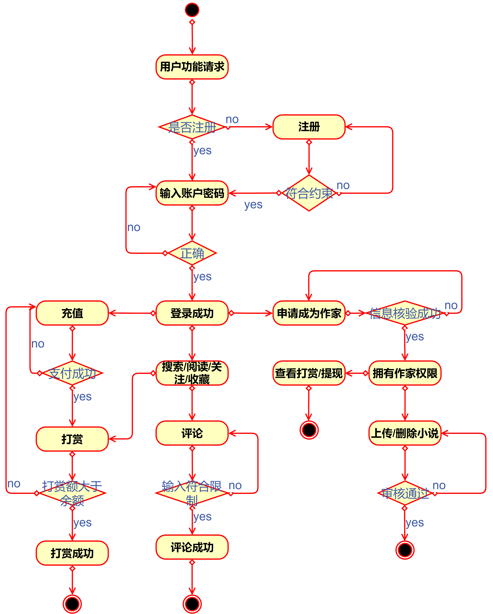

# WebWork
web课程大作业
## 小组成员信息

## [Task2 Web项目建议书](https://github.com/shishc9/WebWork/wiki/Task2--Web%E9%A1%B9%E7%9B%AE%E5%BB%BA%E8%AE%AE%E4%B9%A6)
## [Task3 Web项目需求](https://github.com/shishc9/WebWork/wiki/Task3-Web%E9%A1%B9%E7%9B%AE%E9%9C%80%E6%B1%82)
## [Task4 Web应用建模](https://github.com/shishc9/WebWork/wiki/Task4-Web%E5%BA%94%E7%94%A8%E5%BB%BA%E6%A8%A1)
### 用例图

### 活动图
用户活动图

